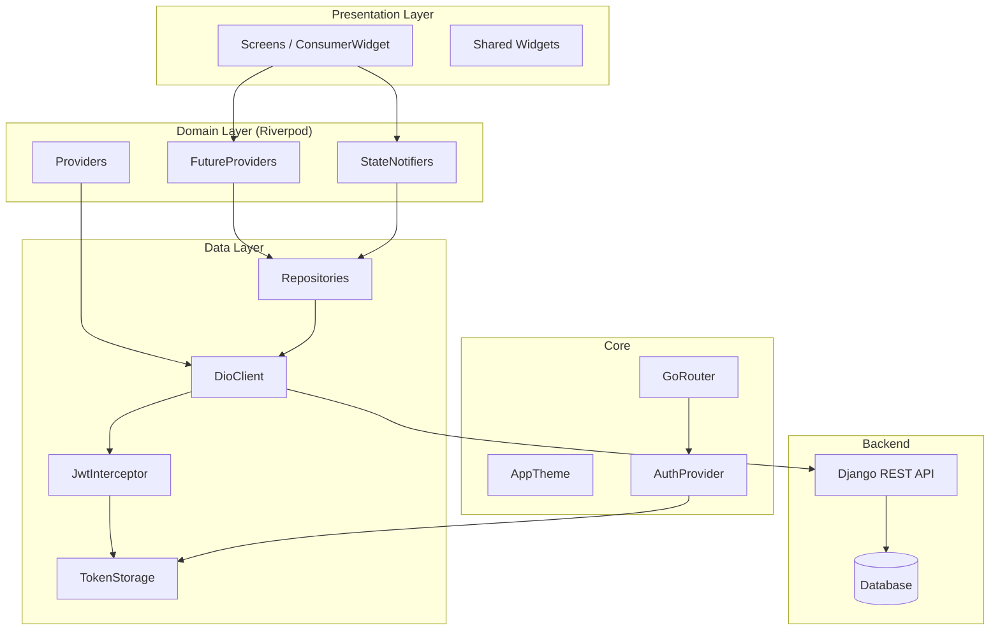

# Architecture — FlowRoll

## Diagrama de Componentes



---

## Flujo de Datos

### Petición típica (lista de atletas)

```
AthletesListScreen
  → watches athletesProvider(AthletesFilter)
  → FutureProvider llama AthletesRepository.listAthletes()
  → DioClient.get('/api/athletes/?academy=1&search=...')
  → JwtInterceptor añade "Authorization: Bearer <token>"
  → Backend devuelve PaginatedResponse<AthleteProfile>
  → Riverpod notifica al widget → rebuild
```

### Flujo de autenticación y refresh

```
Request 401
  → JwtInterceptor.onError()
  → tokenStorage.getRefreshToken()
  → POST /api/auth/token/refresh/ (sin Authorization header)
  → tokenStorage.saveTokens(access, refresh)
  → Retry petición original con nuevo token
  → Flush queue de peticiones pendientes
```

---

## Descripción de Módulos

### `core/`

| Archivo | Responsabilidad |
|---------|-----------------|
| `api/api_constants.dart` | Todas las rutas de la API y parámetros de query — centralizado |
| `api/dio_client.dart` | Instancia única de Dio con timeouts, headers y interceptores |
| `api/jwt_interceptor.dart` | Auto-refresh de token 401, cola de reintentos, limpieza en fallo |
| `api/providers.dart` | Provider de Riverpod para DioClient |
| `auth/auth_provider.dart` | `isAuthenticatedProvider`, `selectedAcademyIdProvider` |
| `auth/token_storage.dart` | Wraps FlutterSecureStorage — lectura/escritura/borrado de tokens |
| `router/app_router.dart` | GoRouter con shell routes, redirect guards de auth |
| `theme/` | Constantes de diseño: colores, tipografía (Google Fonts), espaciado, strings |

### `features/` — Arquitectura por módulo

Cada feature implementa 3 capas:

**data/** — `*_repository.dart`
- Única responsabilidad: llamadas HTTP con Dio
- Devuelve modelos tipados o lanza `ApiException`
- No tiene lógica de negocio ni estado

**domain/** — `*_provider.dart`
- `FutureProvider.family` para datos remotos (auto-invalidación)
- `StateNotifier` para operaciones con estado local (ej: timer de sesión)
- Filtros como objetos valor con `==` y `hashCode` correctos

**presentation/** — `*_screen.dart`
- `ConsumerWidget` o `ConsumerStatefulWidget`
- Lee providers via `ref.watch()`
- Acciones via `ref.read(provider.notifier)`
- No contiene lógica de negocio

### `shared/`

**models/** — Plain Old Dart Objects (PODOs)
- Inmutables donde es posible
- `fromJson` / `toJson` manual (sin code generation)
- Enums con `string` serialization

**widgets/** — Componentes reutilizables

| Widget | Descripción |
|--------|-------------|
| `GlassCard` | Card translúcida con borde sutil — base visual del diseño |
| `BeltBadge` / `BeltChip` | Visualización de cinturón con color y rayas |
| `StatusBadge` | Badge coloreado por estado (matchup, match) |
| `ErrorView` / `EmptyView` | Estados de error y vacío consistentes |
| `ShimmerList` | Loading skeleton con shimmer |
| `AppSearchBar` | Search bar estilizada |
| `Tappable` | Wrapper con feedback táctil (InkWell + tema) |
| `MainShell` | Bottom navigation bar shell |

---

## Decisiones de Diseño (ADRs)

### ADR-001: Riverpod como gestor de estado

**Contexto:** Elegir entre Provider, BLoC, Riverpod, MobX.

**Decisión:** Riverpod 2 con hooks.

**Razones:**
- Type-safe sin `BuildContext` en la capa de dominio
- `FutureProvider.autoDispose.family` es perfecto para datos paginados filtrados
- `StateNotifier` para lógica con estado mutable (timer)
- Mejor DX que BLoC para un equipo pequeño

**Trade-offs:** Mayor curva de aprendizaje inicial vs Provider clásico.

---

### ADR-002: Go Router para navegación

**Contexto:** Elegir entre Navigator 2.0 manual, AutoRoute, Go Router.

**Decisión:** Go Router 13 con shell routes.

**Razones:**
- Shell routes permiten bottom navigation sin perder estado
- Declarativo — las rutas son data, no código imperativo
- Deep linking out-of-the-box (necesario para web)
- Redirect guards limpios para auth

**Trade-offs:** Pasar parámetros complejos requiere serialización (se usa `extra` para objetos).

---

### ADR-003: Clean Architecture ligera por feature

**Contexto:** ¿Hexagonal completa vs MVVM vs Clean ligera?

**Decisión:** Clean architecture simplificada: data → domain → presentation por feature.

**Razones:**
- Sin over-engineering para una app móvil
- Testeable: repositories son inyectables via Riverpod
- Escalable: añadir un feature no toca otros módulos

**Trade-offs:** Sin capa de `UseCase` explícita (la lógica vive en providers/notifiers). Aceptable para este tamaño.

---

### ADR-004: JWT con interceptor en Dio

**Contexto:** ¿Dónde manejar el refresh de tokens?

**Decisión:** `JwtInterceptor` en Dio con cola de peticiones pendientes.

**Razones:**
- Transparente para todos los repositories
- Cola evita múltiples refreshes simultáneos (race condition)
- Timeout específico en la petición de refresh evita hang infinito

**Trade-offs:** La complejidad está concentrada en un solo archivo crítico — requiere tests exhaustivos.

---

### ADR-005: Compile-time config con `--dart-define`

**Contexto:** ¿Cómo gestionar URLs y config por entorno?

**Decisión:** `String.fromEnvironment()` con `--dart-define-from-file=.env`.

**Razones:**
- Las API keys nunca están en el código fuente
- Diferente URL por entorno sin tocar código
- Compatible con CI/CD (variables de entorno del pipeline)

**Trade-offs:** Requiere rebuild para cambiar config (no hot-reload de variables).

---

## Patrones Utilizados

| Patrón | Dónde | Por qué |
|--------|-------|---------|
| Repository | `*/data/*_repository.dart` | Abstrae fuente de datos, testeable con mock |
| Provider / Observer | Riverpod providers | Reactivo, sin boilerplate |
| Interceptor Chain | Dio interceptors | Cross-cutting concerns (auth, logging) |
| Value Object | `*Filter` classes | Equality correcta para family providers |
| Sealed Class | `TimerSessionState` | Modelado exhaustivo de estados |
| Shell Route | `MainShell` | Bottom nav sin perder estado |
| Factory Constructor | Modelos `fromJson` | Parsing centralizado |
